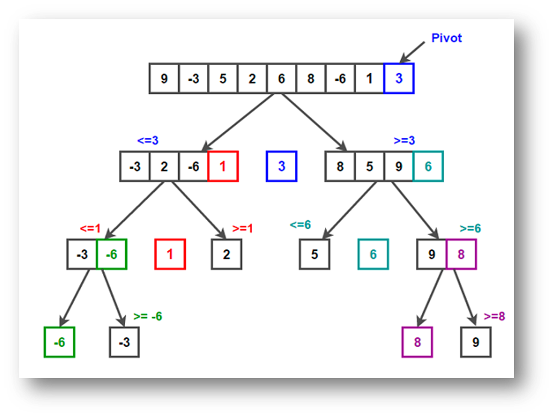

# Quick Sort

Tags: Sorts
Observații: Bun pt examen, merită imbunatatit
Scris?: Yes

## Ce este Quick Sort? 🧐

Este un algoritm bazat pe algoritmul ***Divide et Impera*** care alege un pivot și partiționează vectorul plasându-l pe poziția corectă în vectorul sortat.

---

## Ideea de bază? 🫎

**Divide:** se împarte vectorul în doi subvectori în funcție de un **pivot** **X,** astfel încât elementele din subvectorul din stânga sunt **≤ X ≤** elementele din subvectorul din dreapta   

**Impera:** se sortează recursiv cei doi subvectori

Cum partiționarea este făcută în mod recursiv, algoritmul continuă să pună pivoții aleși în ordine, până când vectorul este sortat.

---

## Algoritm 🐴

### *Partiționarea*

- Toate elementele < decât pivotul ales vor fi puse în stânga pivotului
- Toate elementele ≥ decât pivotul ales vor fi puse în dreapta pivotului

**Partiționarea** se apelează recursiv, ajungându-se ca toate elementele să fie la un momentat pivoți care se așează la locul potrivit.

***Tot vorbim de pivot, dar cum îl alegem?***

### *Alegerea Pivotului*

Pe scurt, o alegere optimă a pivotului este ***Mediana din 3***.

***Ce este mediana din 3?***

- Dacă *low* ≤ *mid* ≤ *high* sau *high* ≤ *mid* ≤ *low*, atunci *mid* este mediana.
- Dacă *mid* ≤ *low* ≤ *high* sau *high* ≤ *low* ≤ *mid*, atunci *low* este mediana.
- Dacă *low* ≤ *high* ≤ *mid* sau *mid* ≤ *high* ≤ *low*, atunci *high* este mediana.

**Alegeri ineficiente de pivot**

- Primul / ultimul element din vector: **Worst case** pentru vectorii deja sortați. Se creează partiții nebalansate. De exemplu dacă alegem ca pivot primul element dintr-un vector sortat, partiția din stânga ar fi goală, iar cea din dreapta ar conține restul elementelor (similar în cazul în care alegem ultimul element).
- Elementul din mijloc: poate duce la partiții dezechilibrate în cazul vectorilor deja sortați sau aproape sortați.

***Ok am înțeles cum partiționăm și ce pivot să alegem. Acum ce facem cu toate informațiile astea?***

***Răspuns: Sortăm…***

- Pornind de la vectorul de input alegem pivotul și partiționăm recursiv (alegând pentru fiecare partiție un alt pivot).
- O să ajungem în punctul în care toate partițiile au doar un element - atunci vectorul este sortat. Ca să înțetelegem mai bine avem următoarea imagine:

*În imagine pivotul ales este ultimul element din vector.*

---

## Complexități ⏱️

**Worst-case: $O(N^2)$.**

- Are loc de obicei când pivotul este ales ineficient. Astfel, apar partiții total nebalansate care duc la un număr maxim de apeluri recursive.

**Average-case: $O(N logN)$.**

**Best-case: $O(N logN)$.**

- Are loc când pivotul ales crează partiții de mărimi cât de cât egale.

**Spațiu: $O(1)$.**

---

## Avantaje ✅

- Algoritm Divide et Impera
- Eficient pentru seturi mari de date
- Folosește puțină memorie

---

## Dezavantaje ❌

- Dacă alegem pivotul ineficient avem complexitate de $O(N^2)$.
- Nu e eficient pentru seturi mici de date.
- Nu e un algoritm de sortare stabil pentru că facem swap între elemente în funcție de pivotul ales dar nu ținem cont de pozițiile lor originale.

---

## Bibliografie

- https://www.geeksforgeeks.org/quick-sort-algorithm/
- Structuri de Date - Curs 2 (*Prof. Marius Dumitran)*
